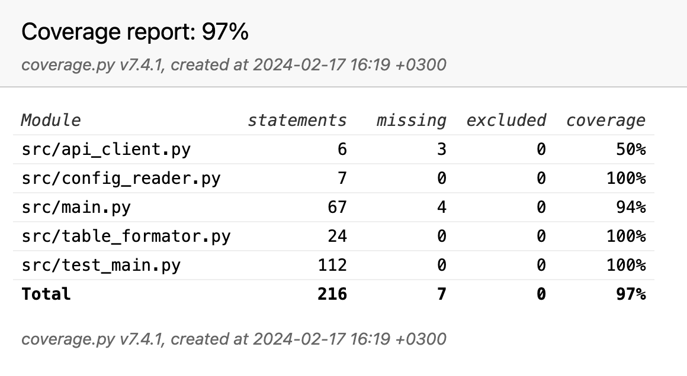

# Телеграм бот команды проекта «Предсказательные модели для игроков и команд EPL»

## Авторы телеграм бота
|| telegram | github |
| ------ | ------ | ------ |
| Чуприн Александр | [@Chew13](https://t.me/Chew13) | [Chewye](https://github.com/Chewye) |
| Дубов Владислав | [@dubov_vv](https://t.me/dubov_vv) | [hotspurs](https://github.com/hotspurs) |

Телеграм бот разработан в рамках годового проекта.

Название бота @HSE_EPL_bot

Доступные команды:
```
- /stats - Статистика команд
- /games_ten - Посмотреть 10 следующих матчей
- /games_today - Посмотреть матчи на сегодня
- /games_tomorrow - Посмотреть матчи на завтра
- /ten_predict - Предсказать 10 следующих матчей
- /today_predict - Предсказать матчи на сегодня
- /tomorrow_predict - Предсказать матчи на завтра
```

Телеграм бот общается по `api` с приложением написанным на `fastapi` - http://5.104.75.226/docs
Сервисы развернуты на виртуалке с помощью `docker-compose `

## Тестирование
Для тестирования бота использовалась библиотека `aiogram_tests`.
Использованы моки для методов, которые загружают данные через API.
Отчет по тестовому покрытию доступен в папке htmlcov
Тестовое покрытие составляет 97%


Код проверен на соответствие стандарту pep 8 с помощью утилиты flake8
В файле .flake8, скорректировано значение для правила `max-line-length`
htmlcov/report.png

